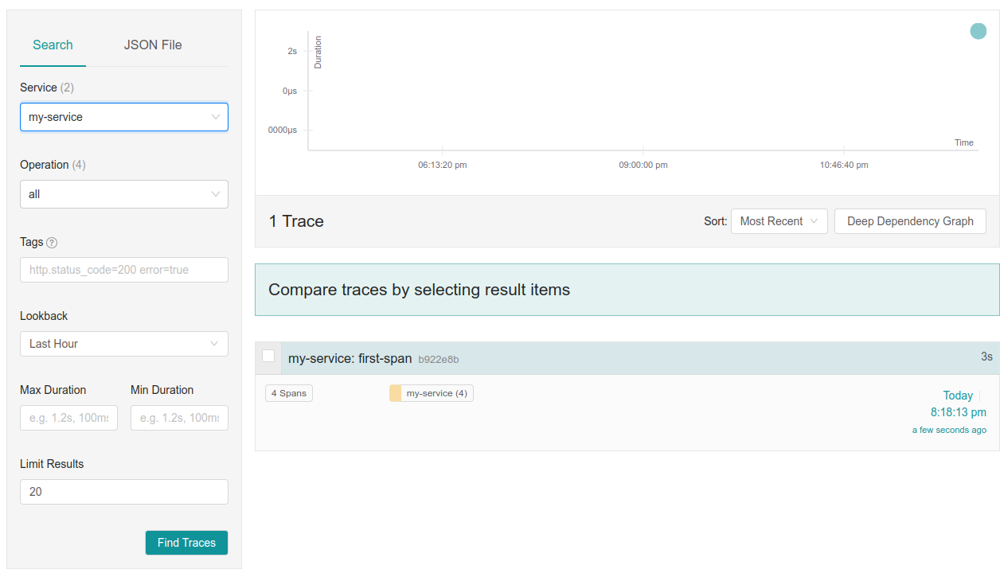
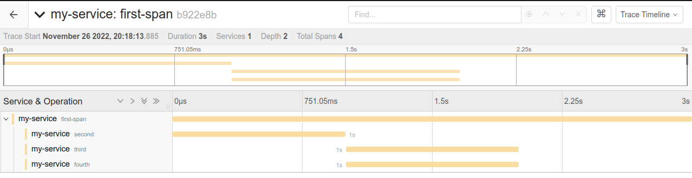

# Introduction to Jaeger Tracing

To get Jaeger running locally:

```bash
docker run -d --name jaeger \
  -e COLLECTOR_ZIPKIN_HOST_PORT=:9411 \
  -p 5775:5775/udp \
  -p 6831:6831/udp \
  -p 6832:6832/udp \
  -p 5778:5778 \
  -p 16686:16686 \
  -p 14250:14250 \
  -p 14268:14268 \
  -p 14269:14269 \
  -p 9411:9411 \
  jaegertracing/all-in-one:1.30
```

This will make the UI available at [http://localhost:16686/](http://localhost:16686/).

Install dependencies for our python program:

```bash
pip3 install -r requirements.txt
```

Create a trace:

```bash
python3 trace.py
```

Open to the UI at [http://localhost:16686/](http://localhost:16686/) and search for traces from `my-service`:



Click on the trace titled `my-service: first-span`:


